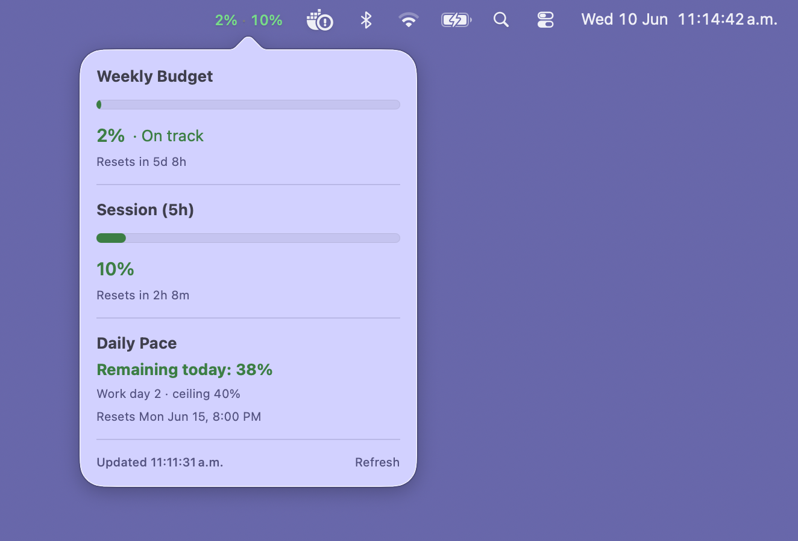

# claude-code-usage-indicator

Monitor your [Claude Code](https://docs.anthropic.com/en/docs/claude-code) usage budget at a
glance. Ships a **Linux COSMIC panel applet**, a **macOS menu bar app**, and a
cross-platform **CLI**, all sharing one Rust core.

## Showcase

| macOS menu bar | Linux (COSMIC panel applet) |
| --- | --- |
|  |  |

## Features

- **At-a-glance indicator** — color-coded weekly and session usage percentages, shown
  directly in the panel (Linux) or menu bar (macOS).
- **Dashboard popup** — weekly budget, session window, daily pace, and reset timers.
- **Pace-based coloring** — green / yellow / red based on whether you're on track for the
  cycle, not just raw usage.

## Project structure

A Cargo workspace plus a Swift package, split so it's clear which code targets which OS:

```
crates/
  cc-usage-budget/         Core logic — credentials, usage API, pace/color math.
                           Platform-agnostic, no GUI deps. Shared by everything.
  cc-usage-cli/            `cc-usage` binary — emits JSON (or human status).
                           Cross-platform; powers the macOS app and is handy in a terminal.
  cosmic-applet-cc-usage/  Linux / Pop!_OS COSMIC panel applet (libcosmic, Wayland).
macos/
  CcUsageMenuBar/          macOS menu bar app (Swift): AppKit NSStatusItem for the colored
                           bar item + SwiftUI popover dashboard. Runs the bundled CLI.
```

The root `Cargo.toml` is a virtual workspace; `cosmic-applet-cc-usage` is excluded from
default builds (it only compiles on Linux/Wayland), so `cargo build` / `cargo test` work on
macOS out of the box.

## Build & install

Uses [`just`](https://github.com/casey/just); recipes auto-dispatch per OS.

```sh
just build      # build the CLI + this platform's GUI
just install    # install this platform's GUI
just test       # test the cross-platform crates
```

### Linux (COSMIC applet)

Requires the [COSMIC desktop](https://github.com/pop-os/cosmic-epoch) and a Rust toolchain.

```sh
just install               # user-local install (no sudo); then add the applet to your panel
just install-system-linux  # system-wide (requires sudo)
```

`just install` auto-dispatches to the Linux recipe (`install-linux`); there are matching
`uninstall-linux` / `uninstall-system-linux` recipes.

### macOS (menu bar app)

Requires a Rust toolchain and the Swift toolchain (Xcode command line tools).

```sh
just run-macos          # build, bundle, and launch
just install-macos      # copy CcUsageMenuBar.app into ~/Applications
```

The build assembles a self-contained `CcUsageMenuBar.app` (ad-hoc signed) with the `cc-usage`
CLI bundled inside it.

> **macOS credentials note:** Claude Code on macOS stores its OAuth token in the **login
> Keychain**, not in `~/.claude/.credentials.json` (the Linux location). The CLI/app read it
> automatically: if no credentials file is found, they fall back to the Keychain item
> `Claude Code-credentials`. The **first run shows a Keychain prompt** — click *Always Allow*.
> Override the item name with `--keychain-service NAME`, or disable the fallback with
> `--no-keychain`.

## CLI

`cc-usage` works on both platforms:

```sh
cc-usage --json          # machine-readable snapshot (the macOS app consumes this)
cc-usage --status        # human-readable report
cc-usage --creds-path /path/to/.credentials.json
cc-usage --daily-budget 20 --work-days 5
```

Other flags: `--timeout SECS` (HTTP request timeout, default 30), `--keychain-service NAME`
(macOS Keychain item, default `Claude Code-credentials`), and `--no-keychain`.

During development you can run the CLI through `just`: `just cli --status` (note: pass the
flags directly, with **no** leading `--`).

On failure it still prints a valid JSON document with an `error` object and exits non-zero.
Optional config file: `~/.config/cc-usage/config.toml` (`creds_path`, `daily_budget`,
`work_days`, `poll_interval_secs`); CLI flags override it. Defaults: `creds_path`
`~/.claude/.credentials.json`, `daily_budget` 20.0, `work_days` 5 (clamped 1–7),
`poll_interval_secs` 300 (minimum 30).

## Configuration (COSMIC applet)

Config is stored at `~/.config/cosmic/dev.fuabioo.CosmicAppletCcUsage/v1/` in RON format,
picked up automatically via hot-reload.

### Custom colors

Override any pace color by creating a file named for the color field:

```sh
echo 'Some((r:0.3,g:0.85,b:0.4,a:1.0))' > ~/.config/cosmic/dev.fuabioo.CosmicAppletCcUsage/v1/color_on_track
```

Available fields: `color_on_track`, `color_warning`, `color_over_budget`. To revert to theme
defaults, delete the file or set its contents to `None`.

## License

MIT
