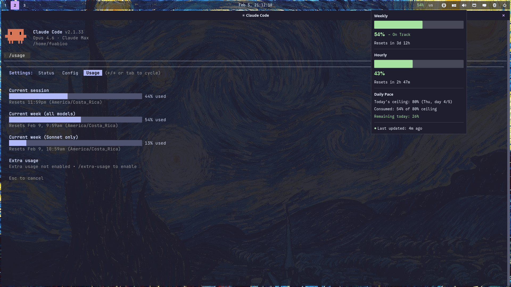

# cosmic-applet-cc-usage

A [COSMIC](https://github.com/pop-os/cosmic-epoch) panel applet for monitoring your [Claude Code](https://docs.anthropic.com/en/docs/claude-code) usage budget at a glance.



## Features

- **Panel indicator** with color-coded weekly and session usage percentages
- **Popup dashboard** showing weekly budget, session window, daily pace, and reset timers
- **COSMIC theme integration** -- colors adapt to dark/light mode automatically
- **Configurable colors** via `cosmic_config` with hot-reload (no restart needed)
- **Adaptive panel display** -- scales from a dot to full stats depending on panel size
- **i18n ready** with Fluent-based localization

## Installation

### Requirements

- [COSMIC desktop environment](https://github.com/pop-os/cosmic-epoch)
- Rust toolchain
- `just` command runner

### Build & Install

```sh
just install
```

Then add the applet to your COSMIC panel.

### Credentials

The applet reads your Claude API token from `~/.claude/.credentials.json` (the same file Claude Code uses). No additional configuration needed.

## Configuration

Config files are stored at `~/.config/cosmic/dev.fuabioo.CosmicAppletCcUsage/v1/` in RON format. Changes are picked up automatically via hot-reload.

### Custom colors

Override any pace color by creating a file with the color field name. For example, to set a custom on-track color:

```sh
echo 'Some((r:0.3,g:0.85,b:0.4,a:1.0))' > ~/.config/cosmic/dev.fuabioo.CosmicAppletCcUsage/v1/color_on_track
```

Available color fields: `color_on_track`, `color_warning`, `color_over_budget`.

To revert to theme defaults, delete the file or set its contents to `None`.

## License

MIT
